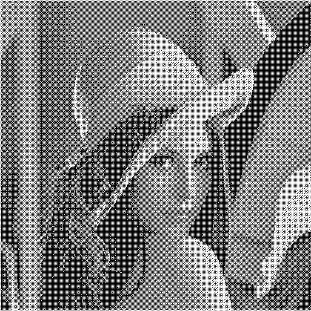

# 3. úkol (maticový rozptyl)
Cílem tohoto cvičení je vyzkoušet si omezování barevného prostoru a jako vedlejší efekt bude seznámení s dalšími webovými technologiemi.

## Úkol:
1. V adresáři **cviceni03** Vytvořte html5 soubor `index.html`, který bude obsahovat jeden element `canvas` s `id="src"`. Veškerý kód v Javascriptu bude umístěn v souboru `script.js`.
2. Do canvasu vykreslete obrázek, který si může uživatel vybrat pomocí dialogového okna.
3. Po kliknutí na tlačítko __Convert__ omezte barevnost obrázku pomocí
    - převodu do šedotónové stupnice (použijte variantu `BT.601`)
    - a následně pomocí maticového rozptylu (4x4), aby výsledný obrázek obsahoval pouze černé a bílé body. 
    - Použijte variantu algoritmu, který nezvětšuje výsledný obrázek
    - Použijte matici, která je vhodná pro obrazovky
    - Použijte distribuci zaokrouhlovací chyby.
4. Vlastní konverzi implementujte ve funkci `convertImageData()`.
5. Bonusové body můžete získat za
    1. Možnost zvolit použitou matici v UI
    2. Možnost měnit hodnotu parametru k v UI
    3. Podpora pro matice jiné velikosti než 4x4
    4. Porovnání výstupů několika matic vedle sebe

## Zásady pro odevzdání úkolu:
1. Pro řešení úkolu se doporučuje použít následující šablonu: https://gitlab.tul.cz/petr.jecmen/pg/tree/master/cviceni03

## Referenční obrázek:

